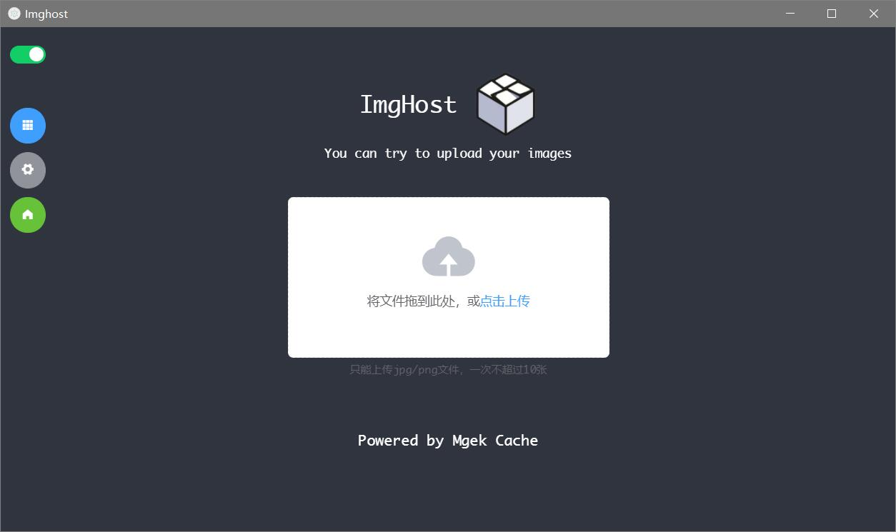
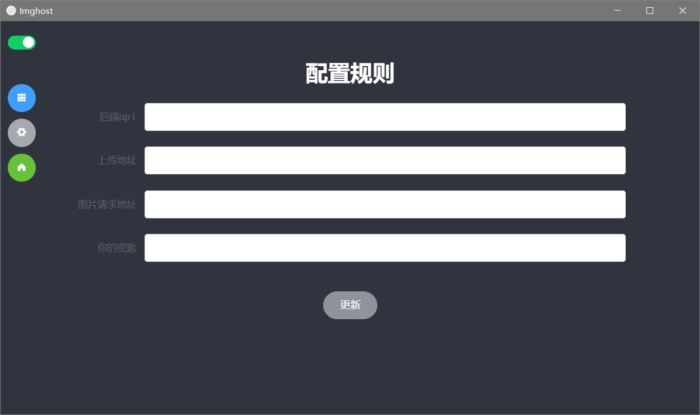
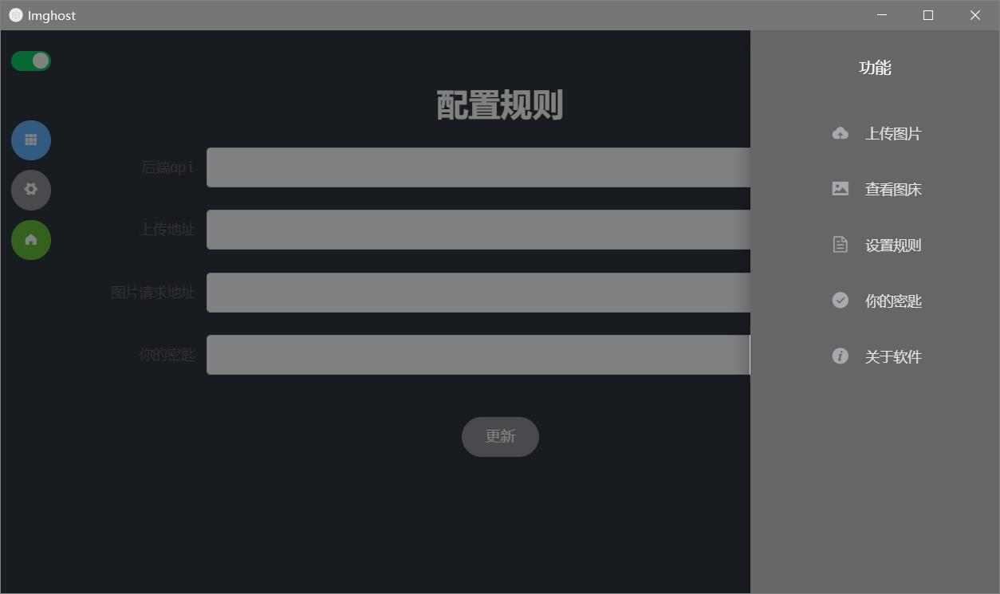

# imghost

## Project setup
```
npm install
```

### Compiles and hot-reloads for development
```
npm run serve
```

### Compiles and minifies for production
```
npm run build
```

### Customize configuration
See [Configuration Reference](https://cli.vuejs.org/config/).

### 简介

Imghost是一个基于eclctron的桌面程序，它是一个简单的图床上传工具。你可以自定义自己的图床api然后使用它上传你的图片。

### 预览







### 配置

使用`setting.json`文件保存配置的上传和预览api地址